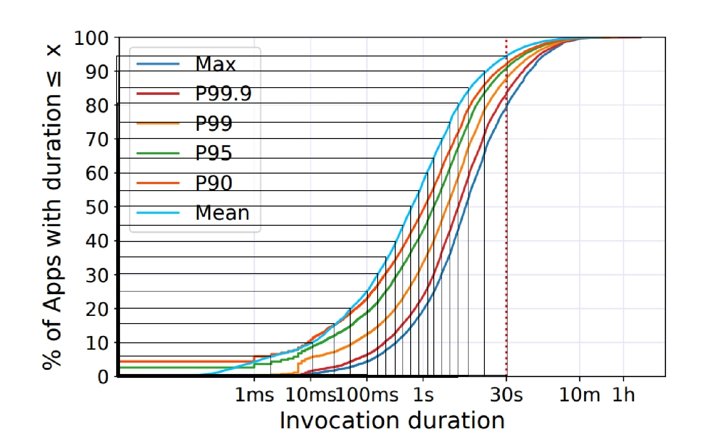

# 实验环境
- Ubuntu 22.04 server，kernel 5.15.0-113-generic
- docker 24.0.7
- go1.22.5 linux/amd64
- kind v0.23.0
- kubernetes：Client Version: v1.30.3，Kustomize Version: v5.0.4-0.20230601165947-6ce0bf390ce3，Server Version: v1.30.0
- knative serving：v1.15.2，包括kn CLI v1.14.0，istio v1.15.1
- 镜像中的python 3.8slim
- 8worker1controller本地k8s集群，每个worker node上安装有redis-server，每个node的虚拟cpu数和虚拟内存容量都跟主机一致

# 实验描述
- 部署的knative服务：python程序（benchmark.py，用run.sh运行），连接节点上的redis-server来执行负载，有一个函数作为基本任务单元，每个实例随机一种任务大小，总体上符合[这篇论文](https://www.microsoft.com/en-us/research/uploads/prod/2021/09/sosp21-final604.pdf)中给出的分布，具体地：任务长度为1, 3, 25, 250, 7500个单位的概率是0.05, 0.03, 0.17, 0.33, 0.37。单跑7500单位的任务需时275s，任务时长超过300s会导致activator超时错误
- 执行的命令：`wrk -t16 -c16 -d1800s -s ./print_response.lua -H "Host: redis-benchmark.default.example.com" http://$GATEWAY_URL -v`，压测过程中原本能跑完的也引发了activator timeout，最终一个7500单位的任务也没跑出来
- benchmark的输出：每行4个数：任务大小（单位数），任务开始时间戳，任务结束时间戳，任务持续时间。最后是执行wrk的时间戳（单位都为毫秒）
- 若不启用autoscaler，即总在单个节点上跑，总执行成功任务数量70/125，包括：
	- 55次“activator request timeout”
	- 4次1单位长度的任务
	- 5次3单位长度的任务
	- 25次25单位长度的任务
	- 36次250单位长度的任务
- 若每个pod的并发期望为1，则共有23个pod实例，分布在各个worker上。总执行成功任务数量100/175，包括：
	- 75次“activator request timeout”
	- 15次1单位长度的任务
	- 5次3单位长度的任务
	- 34次25单位长度的任务
	- 46次250单位长度的任务

# 改进
在分布基本不变的基础上，将时间缩一下，同时细化粒度，免得时间最长的任务跑不起来，另外减少压测时间到600秒，并发程度和autoscaler配置不变

现在的分布为：
`[8000, 4000, 2000, 1000, 700, 500, 350, 250, 200, 150, 100, 50, 40, 30, 25, 15, 5, 3, 2, 1]`，每种概率5%